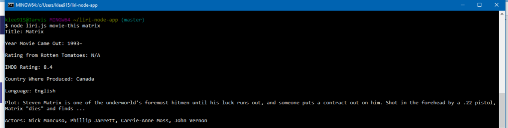
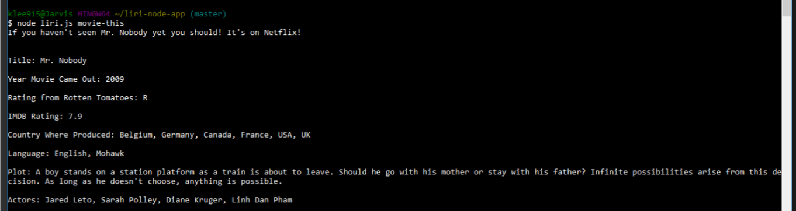
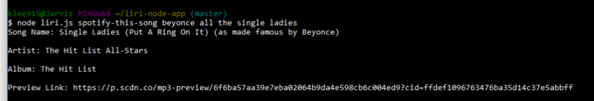
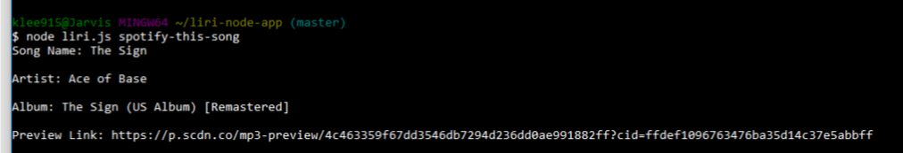

# liri-node-app
This app was made to search songs, movies, and concerts. I used built in npm packages to use commands from the node libaray, and the API's used are:
Spotify
Bands in Town
OMDB Movies
Below are some screenshots of my working code:

For the command movie-this <name of movie here> (search OMDB movie API for info on movie)
  

For the command movie-this <default> (if no movie name is entered, default will be movie for Mr. Nobody)
  
  
For the command spotify-this <name of song here> (searches Spotify API for song info)
  
  
For the command spotify-this <default> (if no song name is entered, default will be song Ace of Base)
  

For the command concert-this <name of artist> (searches Bands in Town API for concert venue and location information)
  
  
For the command do-this (reads info from my random.txt file to pull in commands from another file)
  
